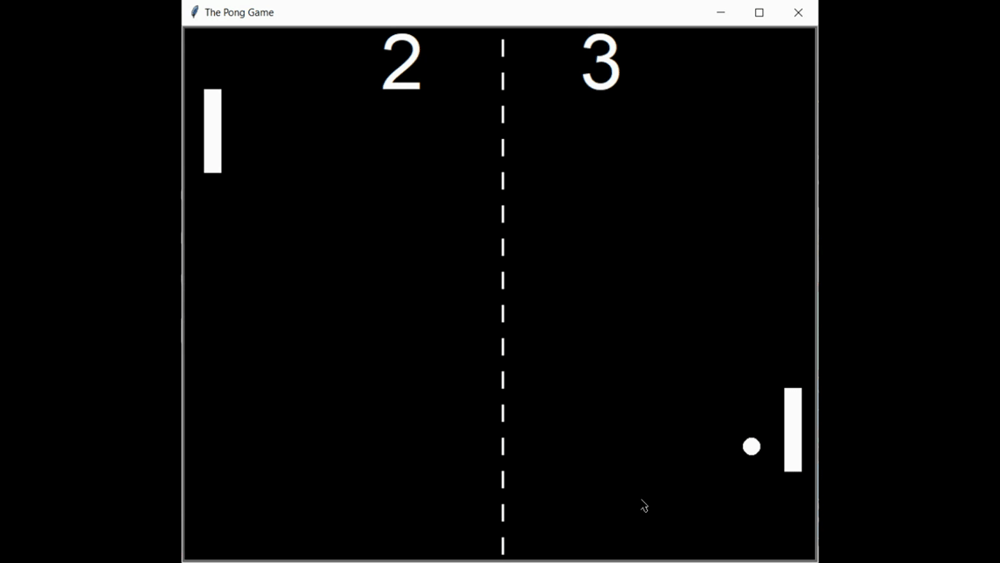

# The Pong Game :white_circle:

## Table of contents
* [Get Started](#get-started)
* [Introduction](#introduction)
* [Demo](#demo)
* [Setup](#setup)
* [Built with](#built-with)
* [How to use](#how-to-use)
* [Logic](#logic)
* [Download](#download)

# Get Started

## Introduction
The Pong game is a table-tennis themed video game, featuring simple two-dimensional graphics. 

* If player1 miss the ball then player2 will get the score.
* If player2 miss the ball then player1 will get the score.
* If the ball hits the boundary then the ball should bounce back. If the ball hits an upper and lower boundary then vertical bounce and if any paddle misses the ball then horizontal bounce.  

## Demo


## Setup
To clone and run this application, you'll need [Git](https://git-scm.com/downloads), [Python](https://www.python.org/downloads/) and pip (already installed with Python 2 >=2.7.9 or Python 3 >=3.4) or [Anacond](https://docs.anaconda.com/anaconda/install/) installed on your computer.

### Built with
* Python version: 3.8.3
* pip version: 20.3.3

### Install
You can install random using pip
```consol
pip install random
```
On Anaconda install random using Anaconda Promt
```consol
conda install random
```

## How to use?
From your command line:
```console
# Clone this repository
$ git clone https://github.com/tirth1/the-pong-game

# Go into the repository
$ cd hangman/app

# run main.py
$ python main.py

```

## Logic
If a player miss the ball then player2 will get the points and the ball needs to bounce back horizontally.

If the ball hits upper or lower the boundary then it needs to bounce vertically

In the ball x_move and y_move will track how much pixel it needs to move and in which direction.
```python

# horizontally bounce
self.move_x *= -1  # It will change the direction of ball wrt x axis

# vertical bounce
self.move_y *= -1  # It will change the direction of ball wrt y axis

```


## Download
You can [download](https://github.com/tirth1/the-pong-game/releases/tag/v1.1) the latest installable version of Hangman for Windows, Linux and macOS.